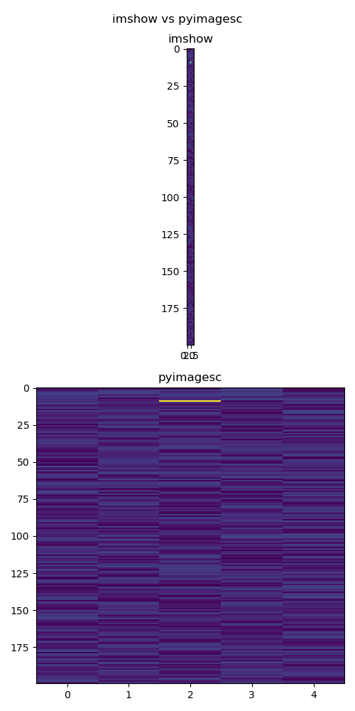

m# pyimagesc

A convenience function for quick display of matrices that are not (even close to) square. This kind of emulates the Matlab style imagesc using matplotlib.

This function is especially useful for __fast exploration of large matrices__.  
Think: debugging, denoising, outlier detection, overview of data organization, pattern detection, etc...  
If you do this a lot, a convenience wrapper makes things, well, more convenient!

## Visual Example

See `doc/generate_previews.py` for the example code generating the below figure:



## Setup

Directly from github:

```bash
pip install git+https://github.com/jkschluesener/pyimagesc.git@main
```

## Usage

### Importing

```python
from pyimagesc import imagesc
```

### Basic Usage

Display a matrix

```python
imagesc(matrix)
```

Or, if you don't want to use this wrapper function:

```python
plt.imshow(matrix,
           aspect='auto', 
           interpolation='none')
```

### Keyword arguments

You can pass normal keywords on to imshow, e.g. `imagesc(matrix, cmap='gray')`

### Figure Handle

The wrapper returns the figure handle. Use it should you need `.show()` or `.savefig()`, etc.

### Axis handle

You can pass an axis handle using the keyword `ax` to this funciton to plot on a specific axis.

## Implementation

This is a wrapper around matplotlib.pylab.imshow(), with the following defaults enabled:

- Use non-square axes, or: don't enforce square pixels.
- Disable interpolation (if possible at all by the backend).

## Interpolation and Backends

Depending on the maplotlib backend you are using, imshow() may override this function's interpolation default of 'none' with 'nearest'.  
The backends `agg`, `ps`, `pdf` and `svg` work as expected.  
Check the imshow documentation for details.
